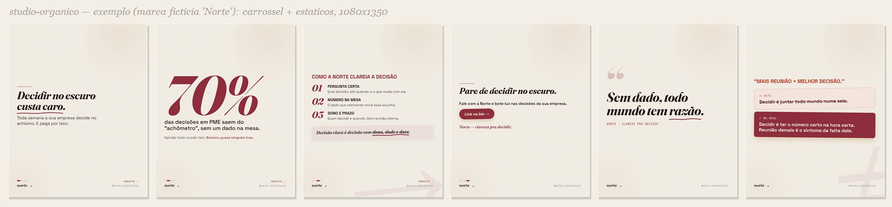

# studio-organico

Fábrica de **conteúdo orgânico** (carrossel + estático, 1080×1350) para Instagram, white-label.
Você dá o contexto da empresa (briefing), o Claude gera os posts com a identidade dela.
Metodologia destilada da Orna: estilo editorial (serifa + accent + grão) com **imagem real que
conversa com a copy** (capa-ícone full-bleed, estilo "G4").



> Acima: exemplo gerado com uma marca fictícia ("Norte", paleta vinho) — carrossel + estáticos.
> Trocar de marca = trocar o `brand.json` (cores, fontes, logo). Capas com imagem real (ícone)
> também são suportadas; aqui usamos só tipografia pra não embutir foto de terceiros.

## Instalar (uso via Claude)
1. Copie a pasta `studio-organico/` inteira para a pasta de skills do Claude
   (ex.: `~/.claude/skills/studio-organico/`) **ou** deixe-a no projeto e peça pro Claude usá-la.
2. Dependências:
   - **Node 18+** (engine de render).
   - **Python + gallery-dl** (motor de imagens): `py -m pip install --user gallery-dl`
     (opcional, recorte de fundo: `pip install rembg`).
   - **Google Chrome** (render HTML→PNG). Precisa de internet (fontes via Google Fonts).
3. No Claude: **`/studio-organico`** e diga o que quer ("configura a marca X", "faz um carrossel sobre…", "3 estáticos sobre…").

## Como funciona (resumo)
1. **Briefing** (`BRIEFING.md`) → gera `projetos/<marca>/brand.json` + `assets/` + `img/`.
2. **Copy** dos posts (na voz da marca, sem cara de IA).
3. **Imagem** que se relaciona com a copy (motor `engine/buscar-imagens.ps1` ou fornecida).
4. **Montar** `conteudo.json` (ver `exemplos/conteudo.exemplo.json`).
5. **Gerar + renderizar:**
   ```
   node engine/gerar.mjs projetos/<marca>/brand.json conteudo.json out
   pwsh engine/render.ps1 -OutDir out        # Windows
   bash engine/render.sh out                 # macOS/Linux
   ```
   PNGs em `out/png/`.

## Estrutura
```
studio-organico/
  SKILL.md                  # o cérebro (regras + fluxo) — lido pelo Claude
  BRIEFING.md               # perguntas pra configurar a marca
  brand.exemplo.json        # modelo do brand.json (cores/fontes/assets)
  exemplos/conteudo.exemplo.json
  engine/
    templates.mjs           # engine genérico (createEngine(brand) -> T.*)
    gerar.mjs               # brand.json + conteudo.json -> HTML
    render.ps1 / render.sh  # HTML -> PNG (Chrome headless)
    buscar-imagens.ps1      # motor de imagens (Pinterest)
  projetos/<marca>/         # criado por marca: brand.json, assets/, img/
```

## Regras firmes
- **A imagem sempre se relaciona com a copy** (o ícone é UMA forma, não a única).
- **Cor da capa = cor do post** (capa escura → tudo escuro; clara → tudo claro).
- **Direito de imagem:** rosto de pessoa famosa em post comercial = risco; decidir antes de publicar.

Feito a partir do template da Orna (`Orna/04_organico/_template-imagem-real`).
